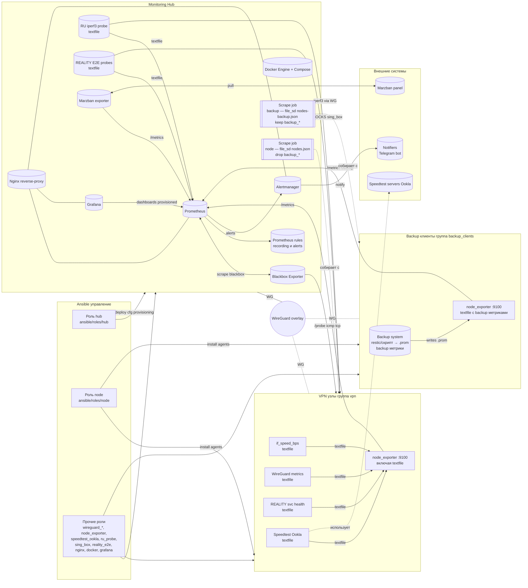

# vff-monitoring

Мониторинг VPN‑инфраструктуры: Prometheus + Grafana + Alertmanager + Blackbox, метрики узлов (node_exporter + textfile), RU‑probe (iperf3), Speedtest (Ookla), WireGuard, REALITY (xray/sing‑box) и E2E‑проверки.

---

## Содержание

- [Архитектура](#архитектура)
- [Интеграции и внешние проекты](#интеграции-и-внешние-проекты)
- [Runbooks / Документация по ролям](#runbooks--документация-по-ролям)
- [Быстрый старт (Make)](#быстрый-старт-make)
- [Полезные команды (Make)](#полезные-команды-make)
- [Требования](#требования)
- [Структура репозитория](#структура-репозитория)
- [Поддержка и вклад](#поддержка-и-вклад)

---

## Архитектура

<details>
<summary><strong>Mermaid-схема</strong></summary>


</details>

---

## Интеграции и внешние проекты

- **Marzban Exporter (Prometheus):** https://github.com/kutovoys/marzban-exporter
- **Marzban (панель управления):** https://github.com/Gozargah/Marzban

---

## Runbooks / Документация по ролям

- Роль **Hub** (Prometheus/Grafana/Alertmanager/Blackbox): [docs/hub-role.md](docs/hub-role.md)
- Роль **Node** (iperf3, if_speed, REALITY, WireGuard‑метрики): [docs/node_role.md](docs/node_role.md)
- Роль Grafana (provisioning, экспорт/импорт дашбордов, токены): [docs/grafana-role.md](docs/grafana-role.md)
- Роли WireGuard (hub/node): [docs/wireguard-roles.md](docs/wireguard-roles.md)
- Роль node_exporter: [docs/node-exporter-role.md](docs/node-exporter-role.md)
- Роль Nginx (reverse‑proxy, certs, htpasswd): [docs/nginx-role.md](docs/nginx-role.md)
- Роль Docker (установка Docker Engine + Compose v2): [docs/docker-role.md](docs/docker-role.md)
- Роль RU Probe (iperf3 throughput): [docs/ru-probe-role.md](docs/ru-probe-role.md)
- Роль Speedtest (Ookla) (textfile‑метрики для node_exporter): [docs/speedtest_ookla.md](docs/speedtest_ookla.md)
- Роль sing_box (установка бинаря sing‑box): [docs/sing_box-role.md](docs/sing_box-role.md)
- Роль Reality E2E (sing‑box энд‑ту‑энд проверка): [docs/reality_e2e-role.md](docs/reality_e2e-role.md)
- **Развёртывание RU‑зонда (ru_zondes):** [docs/NEW_RU_ZONDE.md](docs/NEW_RU_ZONDE.md)
- **Подключение нового VPN‑узла:** [docs/NEW_NODE.md](docs/NEW_NODE.md)
- **Интеграция бэкапов (backup-клиенты + метрики):** [docs/BACKUPS_MONITORING.md](docs/BACKUPS_MONITORING.md)

---

## Быстрый старт (Make)

Минимальный путь для «чистого» хаба:

```bash
# Установить Docker/Compose на хабе
make docker

# Применить роль Hub (Prometheus, Grafana, Alertmanager, Blackbox)
make hub

# Залить provisioning и дашборды Grafana
make grafana
```

Онбординг нового VPN‑узла (WG + агенты + обновления на хабе): [docs/NEW_NODE.md](docs/NEW_NODE.md)

```bash
# Полный сценарий
make add-node HOST=nl-ams-2

# Проверка после онбординга
make add-node-check HOST=nl-ams-2
```

Онбординг **RU‑зонда** (на отдельном хосте или на самом хабе): [docs/NEW_RU_ZONDE.md](docs/NEW_RU_ZONDE.md)

```bash
# Все роли на одном зонде + пересборка WG на хабе + обновление Prometheus
make ru-zondes-setup-host HOST=ru-msk-1

# Все зонды группы + пересборка WG на хабе + обновление Prometheus
make ru-zondes-setup
```

---

## Полезные команды (Make)

```bash
# Общие
make help                         # Справка и примеры
make hub-full                     # Все роли для хаба (site.yml --limit hub)
make status                       # Состояние docker compose стека на хабе
make logs-grafana                 # Хвост логов Grafana (TAIL=200 по умолчанию)
make prom-reload                  # Горячая перезагрузка Prometheus

# Grafana
make grafana-dashboards           # Горячая синхронизация дашбордов
make grafana-pull                 # Экспорт дашбордов из Grafana → репо
make grafana-token                # Выпуск/ротация токена серв. пользователя

# Узлы
make node-bootstrap HOST=<h>      # node + node_exporter + speedtest_ookla
make node-if-speed HOST=<h>       # публиковать/обновить if_speed_bps
make node-speedtest HOST=<h>      # раскатка speedtest (бинарь, юниты, таймер)

# WireGuard
make wg                           # все задачи WG (hub + nodes)
make wg-status                    # 'wg show' на хабе и узлах
make wg-metrics-install HOST=<h>  # раскатка textfile-метрик WG

# REALITY / E2E
make reality-install HOST=<h>     # health‑скрипт (svc) на узле
make reality-e2e                  # роли и таймеры E2E на хабе
make reality-e2e-run PROFILE=p    # разовый запуск сервиса профиля

# RU‑зонды
make ru-zondes-setup-host HOST=<h># все роли на одном зонде → wg-hub → prom-rules
make ru-zondes-setup              # все роли на всех зондах → wg-hub → prom-rules
```

> Любой таргет можно запускать с переменной `ANSIBLE_FLAGS`, например:
> `make grafana-dashboards ANSIBLE_FLAGS='-e grafana_dashboards_use_rsync=true'`

---

## Требования

- Ansible 2.15+
- Docker Engine + Docker Compose v2 на хабе (роль `docker`)
- Доступ по SSH к хабу и узлам, корректные `ansible/hosts.ini`
- Для экспорта/импорта Grafana — сервисный токен или admin‑логин/пароль
- Для E2E: установленный `sing-box` (роль `sing_box`).

---

## Структура репозитория

```
ansible/
  roles/
    hub/                 # стек мониторинга на хабе
    node/                # агенты и скрипты на узлах
    wireguard_*          # WG (hub/node)
    ...
docs/
  *.md                   # runbooks по ролям
grafana/
  dashboards/...         # JSON-дешборды по UID
  provisioning/...       # datasources, dashboards.yml
```

---

## Поддержка и вклад

PR приветствуются: дополнения к ролям, новые дашборды и правила, улучшения документации. Старайтесь сопровождать изменения коротким описанием и примерами проверки.

---

© [VPN for Friends](https://t.me/vpn_for_myfriends_bot) · Monitoring Stack
